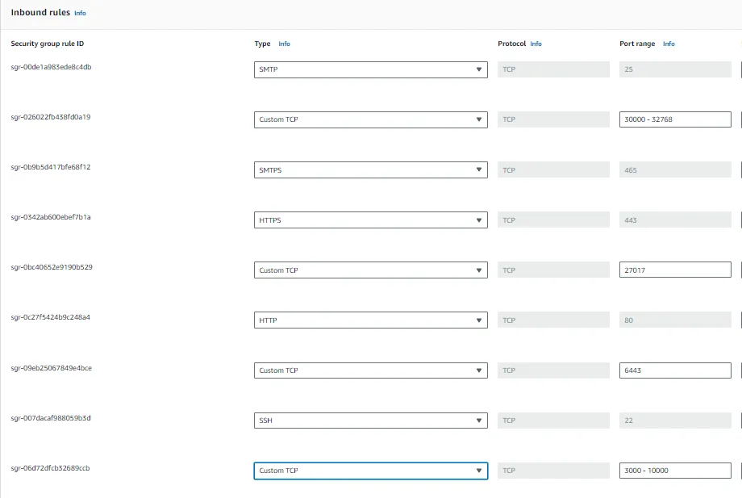

PHASE-1 | Setup Repo

PHASE-2 | Setup Infra

Choose Type of Instance:

In the “Step 2: Choose Type of Instance” section, select the instance type.
This project needs some good amount of resources so it will require some good amount of memory.
Suggested: 8GB RAM 25GB Storage t2.Large
3 instances for Kubernetes Master Node, Worker Node
& Github Action Selfhosted Runner

Create and Execute Script on Both Master & Worker VM For Installing Container Run Time and Installing Kubernetes:

Script (setup.sh):

On Master Node:

Script (init_master.sh):

On Worker Node:

• Copy the kubeadm join command provided in the output of “kubeadm init” from the master node.
• Execute the command on the worker node as the root user.

Create Service Account, Role & Assign that role, And create a secret for Service Account and genrate a Token

Inside Master Node

Creating Service Account:

Create Role:

Bind the role to service account

Generate token using service account in the namespace
[Click here](https://kubernetes.io/docs/reference/access-authn-authz/service-accounts-admin/#:~:text=To%20create%20a%20non%2Dexpiring,with%20that%20generated%20token%20data.)

SetUp SonarQube
Create Sonarqube Docker container To run SonarQube in a Docker container with the provided command, you can follow these
steps:
1. Open your Runner terminal or command prompt.
2. Run the following command:

docker run -d --name sonar -p 9000:9000 sonarqube:lts-community

This command will download the sonarqube:lts-community Docker image from Docker Hub if it’s not already available locally. Then, it will create a container named “sonar” from this image, running it in detached mode (-d flag) and mapping port 9000 on the host machine to port 9000 in the container (-p 9000:9000 flag).

Access SonarQube by opening a web browser and navigating to http://VmIP:9000.
This will start the SonarQube server, and you should be able to access it using the provided URL. If you’re running Docker on a remote server or a different port, replace localhost with the appropriate hostname or IP address and adjust the port accordingly.

Setting Up GitHub Actions Self-hosted Runner on VM

Setting Up Self-hosted Runner:
• Open a terminal or command prompt on the VM.

Registering Runner:
• Go to your GitHub repository where you want to set up the self-hosted runner.
• Navigate to the “Settings” tab.

Accessing Runner Configuration:
• On the left sidebar, click on “Actions”.
• Click on “Runners”.

Adding New Runner:
• Click on “New self-hosted runner”.

Selecting Machine Type:
• Choose the appropriate machine type (Linux, macOS, Windows) based on your VM’s operating system. We will choose LINUX

Executing Commands:
• Follow the instructions provided by GitHub to download and configure the runner. These typically involve running a set of commands.

Starting the Runner:
• After configuring the runner, start it by running the command provided which is ./run.sh

PHASE-3 | CICD

Java CI Pipeline with GitHub Actions
This document outlines the steps to create a continuous integration (CI) pipeline using GitHub Actions for a Java project built with Maven. The pipeline includes steps for building the project, running security scans, performing code quality analysis with SonarQube, building and scanning Docker images, and deploying to Kubernetes. Secrets are used to securely store sensitive information such as authentication tokens and configuration files.

Pipeline Overview:

1. Java Build and Package:
• Sets up JDK 17 using Temurin distribution.
• Builds the Java project using Maven.
• Uploads the generated JAR artifact as a GitHub Action artifact

2. Security Scans:
• Performs file system scan using Trivy.
• Runs SonarQube scan for code quality analysis.

3. Docker Build and Scan:
• Sets up QEMU and Docker Buildx.
• Builds Docker image for the Java application.
• Scans Docker image using Trivy.
• Logs in to Docker Hub using provided credentials. o Pushes the Docker image to Docker Hub.

4. Kubernetes Deployment:
• Uses Kubectl Action to interact with Kubernetes cluster.
• Applies deployment and service configuration from deploymentservice.yaml file to deploy the application to Kubernetes namespace webapps.

Pipeline Configuration:

name: CICD 

on:
  push:
    branches: [ "main" ]
    
jobs:
  build:
    runs-on: self-hosted

    steps:
      - uses: actions/checkout@v3

      - name: Set up JDK 17
        uses: actions/setup-java@v3
        with:
          java-version: '17'
          distribution: 'temurin'
          cache: maven

      - name: Build with Maven
        run: mvn package

      - uses: actions/upload-artifact@v4
        with:
          name: my-artifact
          path: target/*.jar

      - name: Trivy FS Scan
        run: |
          trivy fs --format table -o trivy-fs-report.html .

      - name: SonarQube Scan
        uses: sonarsource/sonarqube-scan-action@master
        env:
          SONAR_TOKEN: ${{ secrets.SONAR_TOKEN }}
          SONAR_HOST_URL: ${{ secrets.SONAR_HOST_URL }}

      - name: Install jq
        run: sudo apt-get update && sudo apt-get install -y jq

      - name: SonarQube Quality Gate check
        id: sonarqube-quality-gate-check
        uses: sonarsource/sonarqube-quality-gate-action@master
        timeout-minutes: 5
        env:
          SONAR_TOKEN: ${{ secrets.SONAR_TOKEN }}
          SONAR_HOST_URL: ${{ secrets.SONAR_HOST_URL }}

      - name: Set up QEMU
        uses: docker/setup-qemu-action@v3

      - name: Set up Docker Buildx
        uses: docker/setup-buildx-action@v3

      - name: Build Docker Image
        run: |
          docker build -t adijaiswal/boardgame:latest .

      - name: Trivy Image Scan
        run: |
          trivy image --format table -o trivy-image-report.html adijaiswal/board:latest

      - name: Login to Docker Hub
        uses: docker/login-action@v3
        with:
          username: ${{ secrets.DOCKERHUB_USERNAME }}
          password: ${{ secrets.DOCKERHUB_TOKEN }}

      - name: Push Docker Image
        run: |
          docker push adijaiswal/boardgame:latest

      - name: Kubectl Action
        uses: tale/kubectl-action@v1
        with:
          base64-kube-config: ${{ secrets.KUBE_CONFIG }}

      - run: |
          kubectl apply -f deployment-service.yaml -n webapps
          kubectl get svc -n webapps
Secrets Configuration: Ensure that the following secrets are configured in your GitHub repository:

• SONAR_TOKEN: Token for authenticating SonarQube scan.
• SONAR_HOST_URL: URL of your SonarQube instance.
• DOCKERHUB_USERNAME: Username for Docker Hub authentication.
• DOCKERHUB_TOKEN: Token for Docker Hub authentication.
• KUBE_CONFIG: Base64 encoded Kubernetes configuration file (kubeconfig) for accessing the Kubernetes cluster.

When you run your Pipeline it will look like this

PHASE-4 | Monitoring
Downloading Prometheus Components and Grafana
Below are the steps to download Prometheus components (Node Exporter, Blackbox Exporter, and Prometheus itself) from the official Prometheus website and Grafana from the Grafana website:

1. Downloading Node Exporter:
• Go to the Prometheus download page: Prometheus Download Page.
• Scroll down to the “Node Exporter” section.
• Choose the appropriate version for your operating system.
• Click on the download link to download the Node Exporter binary.

2. Downloading Blackbox Exporter:
• Go to the Prometheus download page: Prometheus Download Page.
• Scroll down to the “Blackbox Exporter” section.
• Choose the appropriate version for your operating system.
• Click on the download link to download the Blackbox Exporter binary.

3. Downloading Prometheus:
• Go to the Prometheus download page: Prometheus Download Page.
• Scroll down to the “Prometheus” section.
• Choose the appropriate version for your operating system.
• Click on the download link to download the Prometheus binary.

4. Downloading Grafana:
• Go to the Grafana download page: Grafana Download Page.
• Choose the appropriate version for your operating system.
• Click on the download link to download the Grafana binary.

Step-By-Step Tutorial for Monitoring, Please refer https://www.youtube.com/watch?v=FTrTFOLbdm4 at Timestamp 01:06:00

